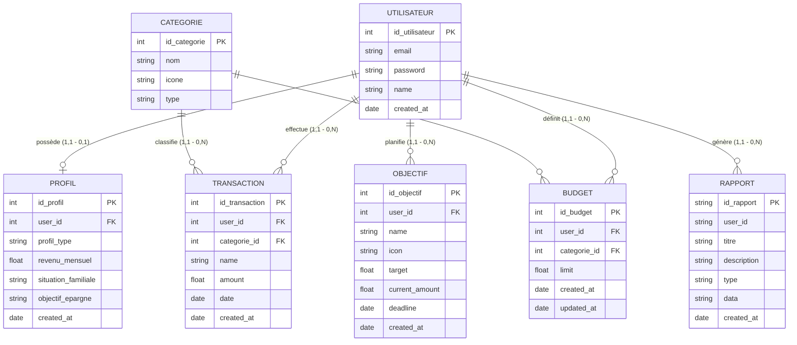
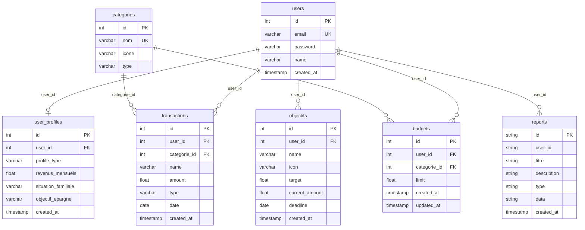
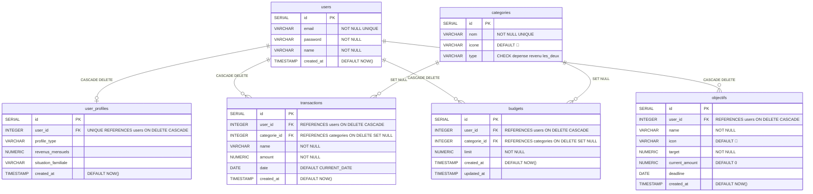

# Modèles de données — My Smart Budget

## MCD corrigé (Modèle Conceptuel de Données)

---

## Erreurs corrigées par rapport à la version précédente

| ❌ Ancien (incorrect) | ✅ Nouveau (correct) |
|---|---|
| `Objectif.id_profil` (PK) | `Objectif.id_objectif` (PK) + `user_id` (FK) |
| `transactions.id_budget` | Supprimé — transactions → catégorie, pas → budget |
| `category` avait les champs de `budget` | `CATEGORIE` a ses propres champs : nom, icone, type |
| Relation "encadre" budget→transactions | Supprimée — elle était fausse |
| Relation "définit" entre category et budget | Renommée "concerne" pour plus de clarté |

---

## MLD (Modèle Logique de Données)

---

## MPD (Modèle Physique de Données — PostgreSQL)

---

## Légende

| Symbole | Signification |
|---|---|
| `\|\|` | Exactement un (obligatoire) |
| `o\|` | Zéro ou un (optionnel) |
| `o{` | Zéro ou plusieurs |
| `PK` | Clé primaire |
| `FK` | Clé étrangère |
| `UK` | Contrainte d'unicité |
